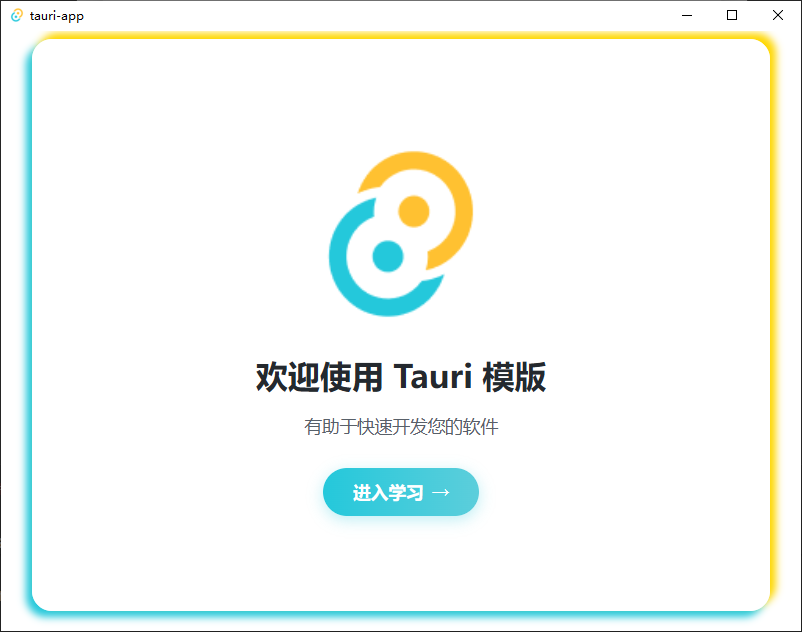
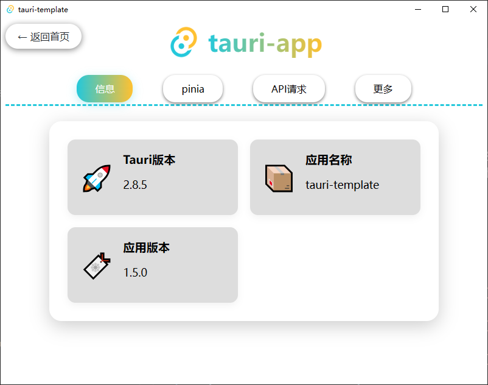
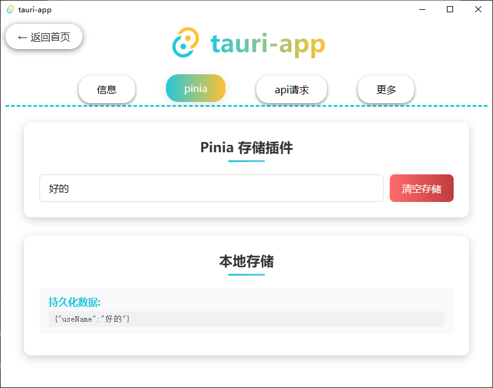
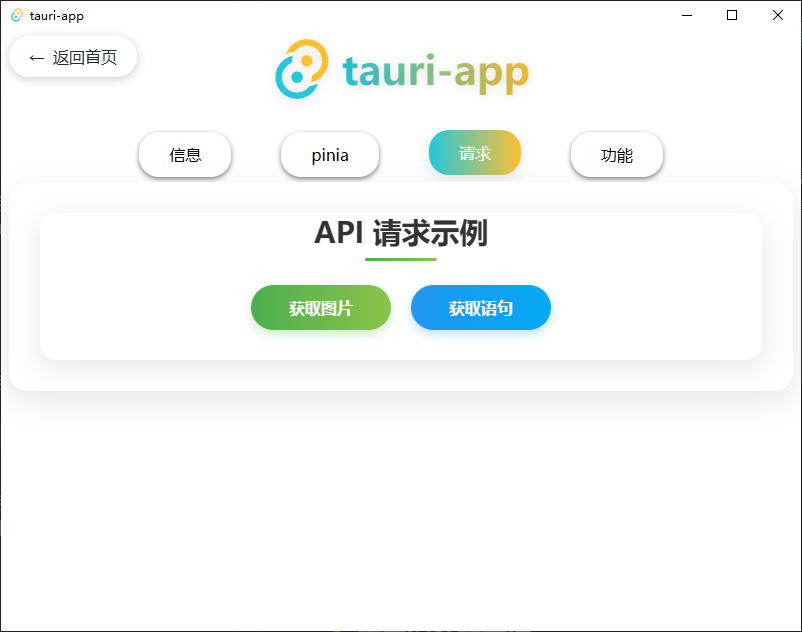
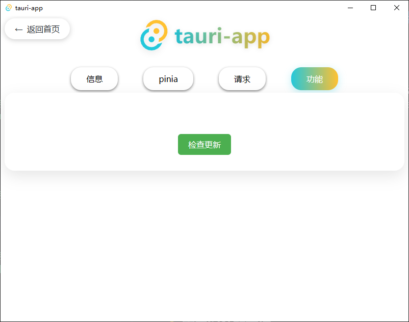

# Tauri 模版项目

<p align="center"><a href="https://tauri.app/start/"></a></p>

<h3 align="center">使用 Vue3 + Ts 的 Tauri 2x 模版</h3>

<br>

<div align="center">
  <a href="https://tauri.app/">
    
  </a>
  <a href="https://cn.vuejs.org/">
    
    <a href="https://www.rust-lang.org/">
    
  </a>
  <a href="https://www.tslang.cn/">
    
  </a>
</div>

---

### 📝项目介绍

  本项目为 Tauri 2x 模版项目，前端采用了 Vue3 + Ts 开发，配置了基础的功能，项目采用了规范的目录结构，方便开发者快速上手和协作开发。

### 🖼️ 界面展示

<div style="display: flex; justify-content: center; flex-wrap: wrap;">
    
    
    
    
    
    <!-- 占位 -->
    <i style="width:45%; margin:10px; height:0;"></i>
</div>

### ✨ 功能特性
<table>
<table>
  <tr>
    <td style="border:3px solid #11cfddff;">
      <ol style="margin:0; padding:0; list-style-position:inside;">
        <li style="padding:8px 12px; border-bottom:2px dashed rgba(17,207,221,.35);">添加 axios 网络请求功能</li>
        <li style="padding:8px 12px; border-bottom:2px dashed rgba(17,207,221,.35);">配置 router 路由导航</li>
        <li style="padding:8px 12px;">添加 pinia，配置持久化</li>
      </ol>
    </td>
  </tr>
</table>


### 🛠️ 推荐安装插件

1.  Vue - Official

2.  Tauri

3.  rust-analyzer


### 📥 使用教程

<a href="https://tauri.app/start/prerequisites/">点击查看前置条件</a>

1. 拉取项目

```shell
# gitee
git clone https://gitee.com/ZeroOpens/tauri-template.git

# github
git clone https://github.com/ZeroOpens/Tauri-Template.git
```

2. 安装依赖

```shell
# npm
npm install -g pnpm

# pnpm
pnpm install
```

3. 运行程序

```shell
# 运行
pnpm tauri dev
```
4. 打包程序

```shell
# 打包
pnpm tauri build
```

### 📁 工程结构解析

```
Tauri-Template
├── src                        # 前端目录
│   ├── assets                 # 静态资源
│   ├── components             # 全局组件
│   ├── hooks                  # 复用函数 
│   ├── pages                  # 路由页面
│   ├── router                 # 路由配置
│   ├── services               # 网络请求
│   ├── stores                 # 存储配置
│   ├── types                  # 类型声明
│   ├── utils                  # 工具函数
│   ├── App.vue                # 根组件
│   └── main.ts                # 入口文件
│   └── vite-env.d.ts          # Vite 类型声明文件
├── src-tauri                  # 后端目录
│   ├── icons                  # 应用图标
│   ├── src                    # Rust 源码目录
│   │   ├── handlers           # 命令处理器
│   │   ├── models             # 数据模型
│   │   ├── services           # 业务逻辑
│   │   ├── utils              # 工具函数
│   │   ├── error.rs           # 错误处理
│   │   └── lib.rs             # 服务层
│   │   └── main.rs            # 程序入口
│   ├── tauri.conf.json        # Tauri 项目的核心配置
│   └── Cargo.toml             # Rust 项目的依赖
├── .gitignore                 # git 忽略文件
├── index.html                 # H5 端首页
├── LICENSE                    # 开源协议
├── package.json               # 前端依赖
├── README.md                  # Markdown 说明文档
└── vite.config.ts             # vite 配置
```

### 📌 版本更新详情

<table>
  <tr>
    <th style="text-align:center; border:3px solid #008249ff; padding:5px 16px;">版本号</th>
    <th style="text-align:center; border:3px solid #008249ff; padding:5px 16px;">发布日期</th>
    <th style="text-align:center; border:3px solid #008249ff; padding:5px 16px;">更新内容</th>
  </tr>
  <!-- v1.4.0 -->
  <tr>
    <td style="text-align:center; border:3px solid #008249ff;">v1.4.0</td>
    <td style="text-align:center; border:3px solid #008249ff;">2025-09-20</td>
    <td style="border:3px solid #008249ff;">
      <ul style="margin:0 0 0 20px; padding:0;">
        <li>Tauri 版本更新至 2.8.5</li>
        <li>添加loading组件替换更新组件</li>
        <li>前端页面和样式调整</li>
      </ul>
    </td>
  </tr>
  <!-- v1.3.0 -->
  <tr>
    <td style="text-align:center; border:3px solid #008249ff;">v1.3.0</td>
    <td style="text-align:center; border:3px solid #008249ff;">2025-07-30</td>
    <td style="border:3px solid #008249ff;">
      <ul style="margin:0 0 0 20px; padding:0;">
        <li>tauri 版本升级2.6.2</li>
        <li>优化风格与布局</li>
        <li>添加更多示例</li>
      </ul>
    </td>
  </tr>
  <!-- v1.2.1 -->
  <tr>
    <td style="text-align:center; border:3px solid #008249ff;">v1.2.1</td>
    <td style="text-align:center; border:3px solid #008249ff;">2025-05-10</td>
    <td style="border:3px solid #008249ff;">
      <ul style="margin:0 0 0 20px; padding:0;">
        <li>添加router</li>
        <li>添加pinia、持久化插件</li>
        <li>添加更多的思路</li>
        <li>添加更多示例</li>
      </ul>
    </td>
  </tr>
  <!-- v1.1.1 -->
  <tr>
    <td style="text-align:center; border:3px solid #008249ff;">v1.1.1</td>
    <td style="text-align:center; border:3px solid #008249ff;">2025-05-06</td>
    <td style="border:3px solid #008249ff;">
      <ul style="margin:0 0 0 20px; padding:0;">
        <li>添加axios和拦截器</li>
        <li>添加跨域问题解决方法</li>
        <li>添加更多示例</li>
      </ul>
    </td>
  </tr>
  <!-- v1.1.0 -->
  <tr>
    <td style="text-align:center; border:3px solid #008249ff;">v1.1.0</td>
    <td style="text-align:center; border:3px solid #008249ff;">2025-05-06</td>
    <td style="border:3px solid #008249ff;">
      <ul style="margin:0 0 0 20px; padding:0;">
        <li>添加更多示例</li>
        <li>修改、删除多余文件</li>
        <li>配置 @ 指定前端src为顶级文件</li>
      </ul>
    </td>
  </tr>
  <!-- v1.0.0 -->
  <tr>
    <td style="text-align:center; border:3px solid #008249ff;">v1.0.0</td>
    <td style="text-align:center; border:3px solid #008249ff;">2025-05-05</td>
    <td style="border:3px solid #008249ff;">
      <ul style="margin:0 0 0 20px; padding:0;">
        <li>初始版本发布</li>
      </ul>
    </td>
  </tr>
</table>


